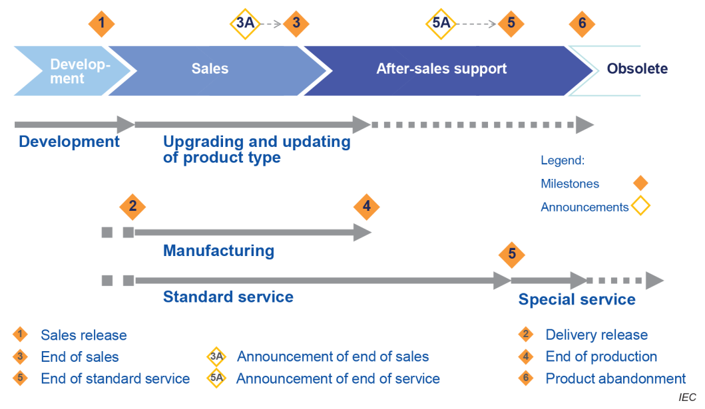
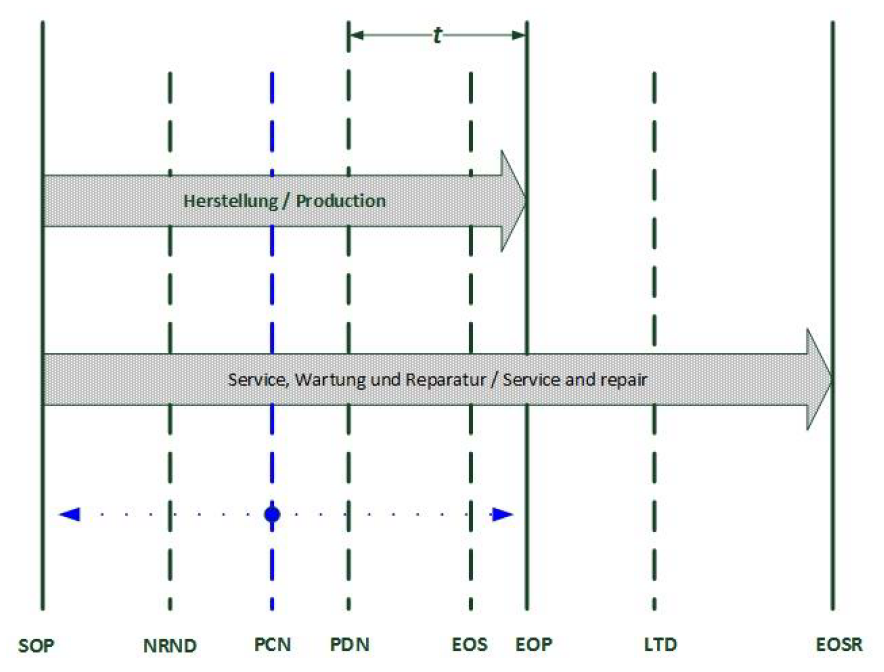
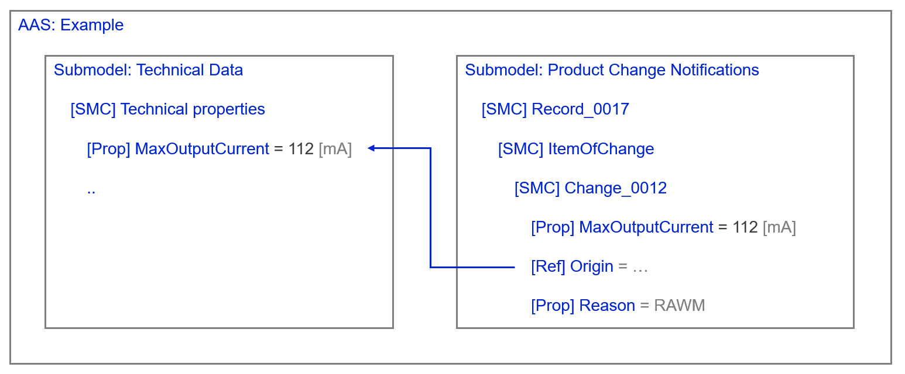
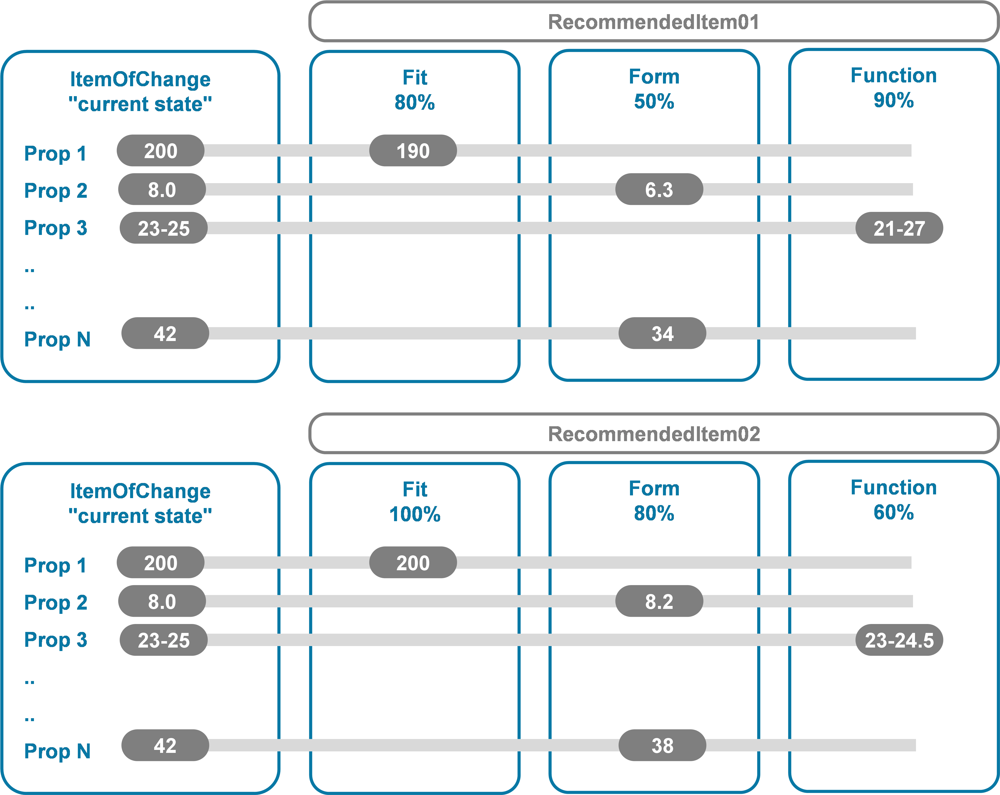
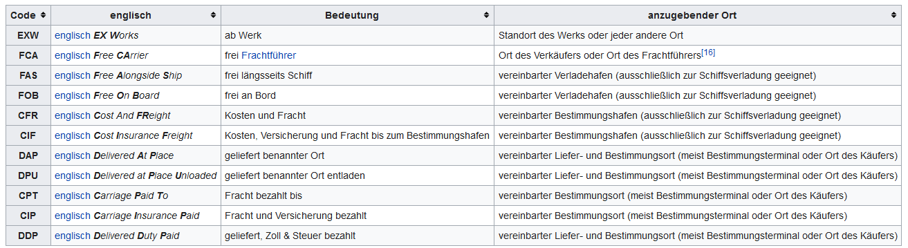

= IDTA 02036-1-0 : Product Change Notifications for industrial product types and items in manufacturing
DRAFT - June 2024

:title-page:

ifndef::env-pdf[]

[width="100%", cols="1,1", frame=none, grid=none]
|===

|{set:cellbgcolor:#0029cc} image:idta-cover-logo-small.png[]
|

2+|
2+|
2+|
2+|

2+|[.huge.white]*IDTA 02036-1-0* 

[.huge.white]*Product Change Notifications* 

[.large.white]*for industrial product types and items in manufacturing*

2+|[.normal.white]#Date: in draft#

2+|
2+|
2+|
|image:idta-spec-badge.png[width="80%"]
|
2+|
2+|
2+|

|[.normal.white]#{nbsp}# +
[.large.white]#Submodel Template specification for the Asset Administration Shell#
|image:idta-smt-badge.png[]

|{set:cellbgcolor:#ffffff}
|

|===

<<<

endif::[]

== IDTA 02036-1-0

=== Imprint 

Publisher
[verse]
____
Industrial Digital Twin Association
Lyoner Strasse 18
60528 Frankfurt am Main
Germany
https://www.industrialdigitaltwin.org/
____

=== Version history

[cols="1,1,4"]
|===

|Date
|Version
|Comment

|2022-05-10
|0.8
|Version 0.8 proposed from VDMA working group Fluidtechnik I4.0.

|2024-02-10
|1.0
|Draft proposed by the Submodel working team. Contact: michael.hoffmeister.hka@gmail.com

|===

:sectnums:

:toclevels: 3

:xrefstyle: short

<<<
toc::[]
<<<

== General

=== About this document
This document is a part of a specification series. Each part specifies the contents of a 
Submodel template for the Asset Administration Shell (AAS). The AAS is described 
in [1], [2], [3] and [6]. First exemplary Submodel contents were described in [4], 
while the actual format of this document was derived by the 
"Administration Shell in Practice" [5]. The format aims to be very concise, 
giving only minimal necessary information for applying a Submodel template, 
while leaving deeper descriptions and specification of concepts, structures and 
mapping to the respective documents [1] to [7].
Common terms and abbreviations can be found in [8].

The target audience of the specification are developers and editors of technical 
documentation and manufacturer information, which are describing assets in 
smart manufacturing by means of the Asset Administration Shell (AAS) and 
therefore need to create a Submodel instance with a hierarchy of 
SubmodelElements. This document especially details on the question, 
which SubmodelElements with which semantic identification shall be 
used for this purpose.

=== Scope of the Submodel
This Submodel template aims at an *interoperable provision of product change notifications* between suppliers and users of industrial product types and *items*, particularly industrial components. These industrial product types and items are typically provided by *manufacturers* and *suppliers*, including dealers, and used by *industrial users*, e.g. original equipment manufacturers (OEMs), system integrators and producing enterprises (industrial end users). The product types are typically used to provide more than one product instance, however special cases such as mass-customization and engineer-to-order are applicable.

Product types have individual life cycles with individual *life-cycle steps* and *milestones*, which are important to know for industrial users to safeguard and continue their business. The aim of this Submodel is to digitialize and interoperably convey sets of minimal required information and to ease the handover of these information sets (records), to make it possible to efficiently filter, monitor and store this information in software systems on industrial user's side.

The *intended use-case* is, that a manufacturer of industrial produces types and items makes respective product change notifications digitally available in a way, that these are interoperable and unambiguously understood by the other market participants, such as industrial users, including OEMs, system integrators or operators of industrial equipment. 

This Submodel template specifies a basic set of SubmodelElements in order to bring about the necessary information according to this use-case.

=== Relevant standards for the Submodel template
According to [3], interoperable properties might be defined by standards, consortium specifcations or manufacturer specifications. This Submodel template therefore takes up the developments of other standards (see <<Table_relevant_standards>>):

[width="100%",cols="40%,60%",options="header", id="Table_relevant_standards", title="Relevant standards for this Submodel template"]
|===
|Standard
|Description

|*IEC 62890:2020-07* — Industrial-process measurement, control and automation - Life-cycle-management for systems and components
|Describes basic concepts of product types and instances and the concepts of a life-cycle mode

|*VDMA 24903* — Obsolescence management – Exchange of information regarding change and discontinuance of products and items	
|Describes important event in the life-cycle of a product type and identifies important information elements to be conveyed

|*IEC 62402:2019* — Obsolescence management
|International standard providing the requirements and guidance for obsolescence management. Taking up the developments from VDMA 24903. IEC 62402:2025 will be formed to a standard series with multiple parts; part 3 will take over the models VDMA 24903.
|===

[NOTE]
This document in this version makes many references to the VDMA 24903. Once all relevant models are taken over to IEC 62402:2025, this document at long last will switch these references to the IEC standard.

So called property dictionaries are used to identify information elements (see Terms and Definitions of [6]). Such property dictionaries include:

•	ECLASS, see: https://www.eclasscontent.com/
•	IEC CDD, see: https://cdd.iec.ch/cdd/iec61987/iec61987.nsf and https://cdd.iec.ch/cdd/iec62683/cdddev.nsf

In this document, properties are aimed to be described by ECLASS.

=== Explanations on used UML diagrams
For clarity and an improved legibility readers are suggested to go through this section at first before reading the following chapters.

The UML diagrams (see <<Example_on_UML>>) feature box-like elements, called "classes". These classes, typically Submodels, SubmodelElementCollections or SubmodelElementLists feature a set of Properties or further SubmodelElements. These elements can have specific cardinalities, e.g. mandatory [1], optionally [0..1], or zero to many [0..\*] or one to many [1..*].

The single classes are hierarchally organized by aggregation relations, these can be seen as "contains" relation.

For a further overview on UML diagrams please refer to [6] and [11]. 

Further details about used table formats please refer to Annex A.
[plantuml, UML_Explanation, svg, id="Example_on_UML", title="Reading aid and example: UML notation used in this document"]
----
@startuml
!theme plain
top to bottom direction
hide class circle
hide class methods
skinparam classAttributeIconSize 0
' skinparam linetype polyline
skinparam linetype ortho

mainframe Example on UML

class "Name of the AAS element" as CL_NOE <<Type of the AAS element>> 
{
  "Name of Property 1" : "Data type" [Cardinality]
  "Name of Property 2" : ..
}

class "Car" as CL_CAR <<TransportationMeans>> 
{
  SteeringWheel : CarbonFibre [1]
  AirCondition : Plastic[0..1]
  Wheel : Rubber [1..*]
  SeatHeating : Metal [0..*]
}

class "Cardinality" as CL_CARD <<Explanation>> 
{
  Mandatory : Cardinality = [1]
  Optinal, max. 1 : Cardinality = [0..1]
  Mandatory , may be several : Cardinality = [1..*]
  Optinal, may be several : Cardinality = [0..*]
}

CL_NOE  *-- CL_CARD : "aggregates"

@enduml
----

== Approaches

=== Assets
This Submodel concerns about the following assets (see <<Table_assets>>):

[cols="1,1",options="header", id="Table_assets", title="Assets concerned by the Submodel"]
|===
|Asset
|Description

|*Product types*, such as model series of industrial components, systems
|Typical application of this Submodel template. Change notifications from product types to be published.

|*Product instances*, such as sold individual products, industrial components, systems	
|Viable application of this Submodel template. Changes of a one-of-a-kind component, system or machine to be published.
|===

=== Life-cycle models
<<Figure_IEC62890>> and <<Figure_VDMA24903>> show the life-cycle models of IEC 62890 and VDMA 24903, which are also compatible with IEC 62890. The life-cycle of a industrial product type or item is basically framed by *SOP* (start of production) and *EOSR* (End Of Service and Repair). Depending on the individual use-case, different time-intervals and life-cycle events are found to be relevant.

Relevant milestones for this Submodel template are found to be (see <<Table_manual_milestones>>):

[width="100%",cols="15%,28%,37%,20%",options="header",title="Relevant milestones for this Submodel template"]
|===
|Milestone |Description (EN) |Description (DE) |0173-10029#09-AAN976#001
|*SOP* |Start Of Production |Beginn der Herstellung
|0173-10029#07-ABO117#001

|*NRND* |Not Recommended for New Design |Nicht empfohlen für
Neukonstruktionen |0173-10029#07-ABO118#001

|*PCN* |Product Change Notice |Produktänderungsmitteilung
|0173-10029#07-ABO119#001

|*PDN*|
Product Discontinuance Notice

for this document: special case of PCN

|Produktabkündigungsmitteilung |0173-10029#07-ABO120#001

|*EOS* |End Of Sale |Einstellung des Vertriebs |0173-10029#07-ABO121#001

|*EOP* |End Of Production |Einstellung der Herstellung
|0173-10029#07-ABO122#001

|*LTD* |Last Time Delivery |Letztmalige Lieferung
|0173-10029#07-ABO123#001

|*EOSR* |End Of Service and Repair |Einstellung von Service, Wartung und
Reparatur |0173-10029#07-ABO124#001
|===

[NOTE]
For some of these milestones, typical deadlines for communication from supplier to users are applicable in specific industrial sectors and markets. These deadlines might be described in a later version of this Submodel template.

The term "product change notification" refers to all of the above milestones, especially also the product discontinuance notice.

=== Relevant information
Various information is expressed in typical product change notification from companies. This includes:

* records of product change notification itself
* details of the change (when, what, why, ..)
* master data of the item provided by the supplier (name, purpose, classification, ..)
* identification of the item, which is subject of the change notification (incl. identification properties, technical properties, logistic information, technical data elements)
* possible subsets of item batches, e.g. range of serial numbers
* identification of item(s), which might be proposed as substitute (incl. identification properties, technical properties, logistic information, technical data elements describing operating ranges)

=== Semantic changes of technical data elements
The `reason` and `item` identification of VDMA 24903 (see section 4.1, 4.2) provide a rather coarse information, that _something_ has changed with respect to these reasons and items. 

To cope with with, the standard and this Submodel template optionally provide files and documents (`«SML» AdditionalInformation`) that give some human-readable information, _what_ has been changed. However, no machine-readable information is given, _what specifically_ has been changed with respect to the item.

This is where the *technical data changes* of this Submodel template add additional machine-readable information: For each `«SMC» Record` and its `«SMC» ItemOfChange`, a list of `«SMC» TechnicalData_Changes` might be added (see <<Figure_Example_scenario>>). These structures identify the technical data element by its `semanticId` and contain new `value` information. Additionally, a *back-reference* to the particular information in the Submodel for technical data can be given, in cases, where the `semanticId` solely is not specific enough.

=== Substitutions and compatibility towards fit, form, function
If the availability of the item of change is going to be limited in the near future, alternative items might be sourced for *product substitution*. In order to pursue this process, the Submodel template allows the promotion of such so called *recommended items*. Each recommended item can potentially be used to substitute the item of change, with a varying degree of suitablility.

This suitablility can only be assessed by the industrial user of the item, e.g. the machine integrator or operator. Therefore, the supplier is able and encouraged to promote multiple possible descriptions of recommended items and to explain the potential suitability by the use of technical data up to a level of sufficient information. The industrial user however is in the position to choose such or another item as substitution.

The benefit for the supplier is to use this channel to promote the optimal range of products to the industrial users. This allows e.g. the promotion of new products with better production costs, a fine-grained portfolio management or to leverage scale effects. Also, the range of preferred series (a.k.a. customer catalogues) can play an important role.

Comparison should follow the well established categories of fit, form, function (see below). The Submodel template allows to provide values for technical data elements (e.g. Properties or Ranges),  both for the actually used item of change (`«SMC» TechnicalData_CurrentState`) and for the recommended items (`«SMC» TechnicalData_(Fit|Form|Function|Other)`). That is, for recommended items, the supplier assigns technical data elements to these 3 categories or other. 

Additionally, an overall percentage (`«Prop» target estimate`) gives a rough indication (see <<Figure_Fit_Form_Function>>). The heuristics for the distinction into fit, form, function and the target estimate lies solely by the supplier of information and is no subject of publication or standardization.

For the distinction of fit, form, function the following statements are given by [9] (see <<Table_Fit_Form_Function>>):

[width="100%",cols="25%,75%",options="header", id="Table_Fit_Form_Function", title="Distinction of fit, form, function [9]"]
|===
|Category
|Description

|*Form*
|The form of a commodity is defined by its configuration (including the geometrically measured configuration), material, and material properties that uniquely characterize it. For software, the form means the design, logic flow, and algorithms.

|*Fit*	
|The fit of a commodity is defined by its ability to physically interface or connect with or become an integral part of another commodity. For software, the fit is defined by its ability to interface or connect with a defense article.

|*Function*
|The function of a commodity is the action or actions it is designed to perform. For software, the function means the action or actions the software performs directly related to a defense article or as a standalone application.
|===

=== Overview UML model
The SubmodelElements described in section 3 are structured in the following way (see <<UML_overview>>):

[plantuml, UML_overview, svg, id="UML_overview", title="UML overview"]
----
include::partial$diagrams/UML_overview.puml[]
----

For the overall Submodel template and its instances, some notes can be given:

* Such Submodel instance consists of multiple records, each of these describing an product change notification (PCN).
* If new notifications occur, records are added to the already existing list `«SML» Records`, typically by adding records with higher numerical index to the list.
* An AAS event element (`«Event» PcnEventsOutgoing`, not shown in overview) serves for emitting AAS events on new PCN records to subscribers.
* Each `«SMC» Record` might feature multiple reasons, why that change notifications occurs, e.g. change of raw materials (`RAWM`).
* Each `«SMC» Record` features a `«SMC» ItemOfChange`, which describes the (industrial) items for which the notifications occurs.
* Such item of change might describe changes in technical data (`«SMC» TechnicalData_Changes`) or might provide technical data for comparison with the recommended items (`«SMC» TechnicalData_CurrentState`).
* If the supply of the changed items stops and substitutes should be described by the supplier, each `«SMC» Record` might feature a number of recommendations (`«SML» RecommendedItems`).
* Such `«SMC» RecommendedItem\__00__` might have another product classification and might describe technical data elements, which differ from the current state of technical data of the item of change. These technical data elements are grouped by fit, form, function or other (not applicable). An example for such group is `«SMC» TechnicalData_Fit`, holding multiple DataElements (not shown).

== Information structures and attributes

=== Submodel template for PCN
For the Submodel instance, the SubmodelElements are described as follows. The table convention is explained in Annex A.2.

// Table generated from [Submodel, www.example.com/ids/sm/7485_0121_2042_6700],[SubmodelElementCollection, Section_3_Information_Structures],[SubmodelElementCollection, Section_3_1_Submodel],[ReferenceElement, Table_Submodel]

[width="100%", id="Table_Submodel", title="Table for elements of Submodel itself", cols="15%,55%,15%,15%"]
|===
s|{set:cellbgcolor:#0029cc} [white]#idShort:#
3+s|{set:cellbgcolor:#eeeeee}ProductChangeNotifications 

s|{set:cellbgcolor:#0029cc} [white]#Class:#
3+|{set:cellbgcolor:#eeeeee}Submodel 

s|{set:cellbgcolor:#0029cc} [white]#semanticId:#
3+|{set:cellbgcolor:#eeeeee}0173-10029#01-XFB001#001 

s|{set:cellbgcolor:#0029cc} [white]#Parent:#
3+|{set:cellbgcolor:#eeeeee}ProductChangeNotifications 

s|{set:cellbgcolor:#0029cc} [white]#Explanation:#
3+|{set:cellbgcolor:#eeeeee} 

s|{set:cellbgcolor:#0029cc} [white]#Element details:#
3+|{set:cellbgcolor:#eeeeee}- 

|{set:cellbgcolor:#0029cc} [white]#[SME type] +
 +
idShort#
| [white]#semanticId +
 +
Description@en#
| [white]#[valueType] +
 +
example#
| [white]#card.#

|{set:cellbgcolor:#eeeeee}[Evt]  +
 +
PcnEventsOutgoing
|http://admin-shell.io/VDMA/Fluidics/ProductChangeNotification/EventsOutgoing/1/0  +
 +
Declaration of an AAS event, which is able to publish the extending of this Submodel by incementally adding product change notifications.  +
Note: Industrial users will subscribe to this event by different implementation technologies.
|[]  +
 +

|0..1

|[SML]  +
 +
Records
|http://admin-shell.io/VDMA/Fluidics/ProductChangeNotification/Record/List/1/0  +
 +
List of records of single product change informations  +
Note: Newer records shall be added by adding a new highest index to the list.
|[]  +
 +
1 elements
|0..1

|===

The records in the Submodel template are complex structures (`«SMC» Record\__0000__`) which are contained in a SubmodelElementList. This makes fast access by the AAS interfaces possible.

The list of records is described as follows. The table convention is explained in Annex A.2.

// Table generated from [Submodel, www.example.com/ids/sm/7485_0121_2042_6700],[SubmodelElementCollection, Section_3_Information_Structures],[SubmodelElementCollection, Section_3_1_Submodel],[ReferenceElement, Table_Records]

[width="100%", id="Table_Records", title="Table for the list of records", cols="15%,55%,15%,15%"]
|===
s|{set:cellbgcolor:#0029cc} [white]#idShort:#
3+s|{set:cellbgcolor:#eeeeee}Records 

s|{set:cellbgcolor:#0029cc} [white]#Class:#
3+|{set:cellbgcolor:#eeeeee}SubmodelElementList 

s|{set:cellbgcolor:#0029cc} [white]#semanticId:#
3+|{set:cellbgcolor:#eeeeee}http://admin-shell.io/VDMA/Fluidics/ProductChangeNotification/Record/List/1/0 

s|{set:cellbgcolor:#0029cc} [white]#Parent:#
3+|{set:cellbgcolor:#eeeeee}Records 

s|{set:cellbgcolor:#0029cc} [white]#Explanation:#
3+|{set:cellbgcolor:#eeeeee}Note: Newer records shall be added by adding a new highest index to the list. 

s|{set:cellbgcolor:#0029cc} [white]#Element details:#
3+|{set:cellbgcolor:#eeeeee}orderRelevant=Yes, semanticIdListElement=[GlobalReference, 0173-10029#01-XFB002#001], typeValueListElement=SubmodelElementCollection 

|{set:cellbgcolor:#0029cc} [white]#[SME type] +
 +
idShort#
| [white]#semanticId +
 +
Description@en#
| [white]#[valueType] +
 +
example#
| [white]#card.#

|{set:cellbgcolor:#eeeeee}[SMC]  +
 +
Record__0000__
|0173-10029#01-XFB002#001  +
 +
Individual records of product change notification; provided by the manufacturer; extended over life-time. 
|[]  +
 +
12 elements
|0..*

|===

=== Single PCN record
The following UML model shows the structure and attributes of a single PCN record (see Figure 6).

* By `«SMC» Manufacturer`, the manufacturers legal name and address is given. For the latter, a *SMT dropin* for contact information is used.

* By `«SMC» LifeCycleData`, an update of one or multiple milestone-specific dates of validity might be communicated, e.g. for EOS = end of sales.

* By `«SMC» ReasonOfChange`, one or multiple reason of changes for this single records can be set. That is e.g., the record might communicate, that `LABEL` and `SOFTWARE` led to this PCN.

* By `«SMC» PcnChangeInformation`, human readable text information (e.g. title and text body) extends the understanding of the PCN record. 

* Optionally, human readable file content can be given by a set of files in `«SML» AdditionalInformations`.

* Item specific information is described by `«SMC» ItemOfChange` and by possible `«SMC» RecommendedItem\__00__`.

[plantuml, UML_Record, svg, id="UML_Record", title="UML for single PCN record (selected classes)"]
----
include::partial$diagrams/UML_Record.puml[]
----

For the record itself, the SubmodelElements are described as follows. The table convention is explained in Annex A.2.

// Table generated from [Submodel, www.example.com/ids/sm/7485_0121_2042_6700],[SubmodelElementCollection, Section_3_Information_Structures],[SubmodelElementCollection, Section_3_2_Information_structure_of_a_PCN_record],[ReferenceElement, Table_Record]

[width="100%", id="Table_Record", title="Table for single PCN record", cols="15%,55%,15%,15%"]
|===
s|{set:cellbgcolor:#0029cc} [white]#idShort:#
3+s|{set:cellbgcolor:#eeeeee}Record__0000__ 

s|{set:cellbgcolor:#0029cc} [white]#Class:#
3+|{set:cellbgcolor:#eeeeee}SubmodelElementCollection 

s|{set:cellbgcolor:#0029cc} [white]#semanticId:#
3+|{set:cellbgcolor:#eeeeee}0173-10029#01-XFB002#001 

s|{set:cellbgcolor:#0029cc} [white]#Parent:#
3+|{set:cellbgcolor:#eeeeee}Record__0000__ 

s|{set:cellbgcolor:#0029cc} [white]#Explanation:#
3+|{set:cellbgcolor:#eeeeee} 

s|{set:cellbgcolor:#0029cc} [white]#Element details:#
3+|{set:cellbgcolor:#eeeeee}- 

|{set:cellbgcolor:#0029cc} [white]#[SME type] +
 +
idShort#
| [white]#semanticId +
 +
Description@en#
| [white]#[valueType] +
 +
example#
| [white]#card.#

|{set:cellbgcolor:#eeeeee}[SMC]  +
 +
Manufacturer
|0173-10029#01-XFB003#001  +
 +
Set of information identifying the manufacturer or supplier, which puts the described items on the market. 
|[]  +
 +
2 elements
|

|[Prop]  +
 +
ManufacturerChangeID
|0173-10029#02-ABC507#001  +
 +
Id of change given by and specific to individual namespace of the manufacturer. 
|[String]  +
 +
CN123456
|0..1

|[SML]  +
 +
LifeCycleData
|http://admin-shell.io/VDMA/Fluidics/ProductChangeNotification/LifeCycleData/List/1/0  +
 +
Set of life cycle milestones, which are set with a new validity date 
|[]  +
 +
1 elements
|0..1

|[SML]  +
 +
ReasonsOfChange
|http://admin-shell.io/VDMA/Fluidics/ProductChangeNotification/ReasonOfChange/List/1/0  +
 +
One or more classifications of reason of change.  +
Note: Multiple classification systems might be used. +
Constraint: At least one reason according VDM24903 shall be given.
|[]  +
 +
1 elements
|1

|[SML]  +
 +
ItemCategories
|http://admin-shell.io/VDMA/Fluidics/ProductChangeNotification/ItemCategory/List/1/0  +
 +
Categorizations of the item of change either as a whole or affect sub-item according VDMA 24903 and further norms  +
Note: Multiple classification systems might be used. +
Constraint: At least one item category according VDM24903 shall be given.
|[]  +
 +
1 elements
|1

|[SML]  +
 +
AffectedPartNumbers
|http://admin-shell.io/VDMA/Fluidics/ProductChangeNotification/AffectedPartNumber/List/1/0  +
 +
Set of part numbers affected by the present product change notification, if not the whole set for product family and designation  +
Contraint: Affected part numbers shall only be listed, if not the full range of part numbers produced for this item (product family and designation) is affected. +
Note: Multiple single part numbers with wildcards or ranges of part numbers are listed.
|[]  +
 +
1 elements
|0..1

|[MLP]  +
 +
PcnReasonComment
|0173-1#02-ABF814#002  +
 +
Comment explaining the reason of change and further circumstances in natural language.   +
To be substituted by PcnChangeInformation ??
|[]  +
 +
End of sales and substitution with superior product with IO Link.@en
|0..1

|[SMC]  +
 +
PcnChangeInformation
|http://admin-shell.io/VDMA/Fluidics/ProductChangeNotification/PcnChangeInformation/1/0  +
 +
Set of information detailing on the particular changes of a product change notification 
|[]  +
 +
2 elements
|

|[SML]  +
 +
AdditionalInformations
|http://admin-shell.io/VDMA/Fluidics/ProductChangeNotification/AdditionalInformation/List/1/0  +
 +
Sets of information to provide human readable content, e.g. conventional PCN document  +
Note: Suppliers are encouraged to add the conventional "product change information" documents and further details, e.g. photo-based or geometric change information to the PCN record.
|[]  +
 +
1 elements
|0..1

|[Prop]  +
 +
DateOfRecord
|0173-1#02-ABF816#002  +
 +
UTC calendar date when the record of change was initially published by the manufacturer  +
Note: Date is in UTC (coordinated universal time).
|[String]  +
 +
2022-07-26T18:27Z
|

|[SMC]  +
 +
ItemOfChange
|0173-10029#01-XFB006#001  +
 +
Information set which describes an item of change by the manufacturer 
|[]  +
 +
9 elements
|

|[SML]  +
 +
RecommendedItems
|http://admin-shell.io/VDMA/Fluidics/ProductChangeNotification/RecommendedItem/List/1/0  +
 +
A number of recommened items, which propose substitution of the item of change, if this becomes unavailable  +
Note: The supplier is encoraged to provide recommended items.
|[]  +
 +
1 elements
|0..1

|===

=== ItemOfChange
The following UML model shows the structure and attributes of the item of change. As sub-structures, product classifications, changes to the technical data by this record and the current state of technical data, compared to the recommended items, are found.

Note: ItemOfChange and RecommendedItem\__00__ use a similar set of SubmodelElements. For the sake of clarity, these structures are described by distinct ConceptDescriptions with clearly identified possibilities and cardinalities.

[plantuml, UML_ItemOfChange, svg, id="UML_ItemOfChange", title="UML for item of change"]
----
include::partial$diagrams/UML_ItemOfChange.puml[]
----

For the item of change, the SubmodelElements are described as follows. The table convention is explained in Annex A.2.

// Table generated from [Submodel, www.example.com/ids/sm/7485_0121_2042_6700],[SubmodelElementCollection, Section_3_Information_Structures],[SubmodelElementCollection, Section_3_3_Information_structure_of_a_ItemOfChange],[ReferenceElement, Table]

[width="100%", id="Table", title="Table for item of change", cols="15%,55%,15%,15%"]
|===
s|{set:cellbgcolor:#0029cc} [white]#idShort:#
3+s|{set:cellbgcolor:#eeeeee}ItemOfChange 

s|{set:cellbgcolor:#0029cc} [white]#Class:#
3+|{set:cellbgcolor:#eeeeee}SubmodelElementCollection 

s|{set:cellbgcolor:#0029cc} [white]#semanticId:#
3+|{set:cellbgcolor:#eeeeee}0173-10029#01-XFB006#001 

s|{set:cellbgcolor:#0029cc} [white]#Parent:#
3+|{set:cellbgcolor:#eeeeee}ItemOfChange 

s|{set:cellbgcolor:#0029cc} [white]#Explanation:#
3+|{set:cellbgcolor:#eeeeee} 

s|{set:cellbgcolor:#0029cc} [white]#Element details:#
3+|{set:cellbgcolor:#eeeeee}- 

|{set:cellbgcolor:#0029cc} [white]#[SME type] +
 +
idShort#
| [white]#semanticId +
 +
Description@en#
| [white]#[valueType] +
 +
example#
| [white]#card.#

|{set:cellbgcolor:#eeeeee}[MLP]  +
 +
ManufacturerProductFamily
|0173-1#02-AAU731#001  +
 +
2nd level of a 3 level manufacturer specific product hierarchy  +
Note: mandatory property according to EU Machine Directive 2006/42/EC.
|[]  +
 +
Pressure sensor@en
|

|[MLP]  +
 +
ManufacturerProductDesignation
|0173-1#02-AAW338#001  +
 +
Short description of the product (short text)   +
Note: mandatory property according to EU Machine Directive 2006/42/EC.
|[]  +
 +
SDE3-D10Z-B-HQ4-2N-M8@en
|

|[MLP]  +
 +
OrderCodeOfManufacturer
|0173-1#02-AAO227#002  +
 +
  +
Note: Optional, as it might not exist for long term used items.
|[]  +
 +
FMABC1234@en
|0..1

|[Ref]  +
 +
ManufacturerAssetID
|0173-10029#02-ABF978#001  +
 +
Reference to asset identification of the item in the domain of the manufacturer.  +
Note: This can be used to easily retrieve further information on the described item, such as full technical data, documentation, MCAD or ECAD models and more..
|[]  +
 +

|0..1

|[SML]  +
 +
ProductClassifications
|http://admin-shell.io/VDMA/Fluidics/ProductChangeNotification/ProductClassification/List/1/0  +
 +
Set of product classifications  +
Note: It is encouraged to provide the actual product classficiation, e.g. by ECLASS, in order to ease the identification of relevant items by the industrial user.
|[]  +
 +
1 elements
|0..1

|[Prop]  +
 +
HardwareVersion
|0173-1#02-AAN270#002  +
 +
version of the hardware supplied with the device 
|[String]  +
 +
1.1
|0..1

|[Prop]  +
 +
RemainingAmountAvailable
|0173-1#02-BAF551#003  +
 +
Quantitative statement about the set of products in warehouse / storage  +
Note: This is an indicative figure; the manufacturer/ supplier may use a heuristical model to distribute available stock to a forecasted number of industrial users. Useful for industrial users to assess individual need of products against assumed availability.
|[PositiveInteger]  +
 +
4500
|0..1

|[SMC]  +
 +
TechnicalData_Changes
|http://admin-shell.io/VDMA/Fluidics/ProductChangeNotification/TechnicalData_Changes/List/1/0  +
 +
Information elements provided to describe changes in (existing) technical data of the item in a semantically enabled way 
|[]  +
 +
3 elements
|0..1

|[SMC]  +
 +
TechnicalData_CurrentState
|http://admin-shell.io/VDMA/Fluidics/ProductChangeNotification/TechnicalData_CurrentState/List/1/0  +
 +
Set of technical data elements describing the current state of the item of change compared with other recommended items  +
Note: For the recommended items, the technical data elements are individually grouped in fit, form, function, other. As different alternatives might engange different groupings, the respective technical data elements of the item of change are not grouped, at all. +
Note: If possible, technical data elements in the recommended items should find its counterparts here (that is: DataElement with identical semanticId).
|[]  +
 +
1 elements
|0..1

|===

=== RecommendedItem
If the availability of the item of change is going to be limited in the near future, an alternative item might be sourced. Recommendations from suppliers side are described by such recommended items. The following UML model shows the structure and attributes of such recommended item. As the structure is complex, multiple sub-classes are shown in the UML model. These sub-classes will be described in later sections.

Note: ItemOfChange and RecommendedItem\__00__ use a similar set of SubmodelElements. For the sake of clarity, these structures are described by distinct ConceptDescriptions with clearly identified possibilities and cardinalities.

[plantuml, UML_RecommendedItem, svg, id="UML_RecommendedItem", title="UML for recommended item"]
----
include::partial$diagrams/UML_RecommendedItem.puml[]
----

For the recommended items, the SubmodelElements are described as follows. The table convention is explained in Annex A.2.

// Table generated from [Submodel, www.example.com/ids/sm/7485_0121_2042_6700],[SubmodelElementCollection, Section_3_Information_Structures],[SubmodelElementCollection, Section_3_4_Information_structure_of_a_RecommendedItem],[ReferenceElement, Table_RecommendedItem]

[width="100%", id="Table_RecommendedItem", title="Table for recommended item", cols="15%,55%,15%,15%"]
|===
s|{set:cellbgcolor:#0029cc} [white]#idShort:#
3+s|{set:cellbgcolor:#eeeeee}RecommendedItem\__00__ 

s|{set:cellbgcolor:#0029cc} [white]#Class:#
3+|{set:cellbgcolor:#eeeeee}SubmodelElementCollection 

s|{set:cellbgcolor:#0029cc} [white]#semanticId:#
3+|{set:cellbgcolor:#eeeeee}http://admin-shell.io/VDMA/Fluidics/ProductChangeNotification/RecommendedItem/1/0 

s|{set:cellbgcolor:#0029cc} [white]#Parent:#
3+|{set:cellbgcolor:#eeeeee}RecommendedItem\__00__ 

s|{set:cellbgcolor:#0029cc} [white]#Explanation:#
3+|{set:cellbgcolor:#eeeeee} 

s|{set:cellbgcolor:#0029cc} [white]#Element details:#
3+|{set:cellbgcolor:#eeeeee}- 

|{set:cellbgcolor:#0029cc} [white]#[SME type] +
 +
idShort#
| [white]#semanticId +
 +
Description@en#
| [white]#[valueType] +
 +
example#
| [white]#card.#

|{set:cellbgcolor:#eeeeee}[MLP]  +
 +
ManufacturerProductFamily
|0173-1#02-AAU731#001  +
 +
2nd level of a 3 level manufacturer specific product hierarchy  +
Note: mandatory property according to EU Machine Directive 2006/42/EC.
|[]  +
 +
Pressure sensor@en
|

|[MLP]  +
 +
ManufacturerProductDesignation
|0173-1#02-AAW338#001  +
 +
Short description of the product (short text)   +
Note: mandatory property according to EU Machine Directive 2006/42/EC.
|[]  +
 +
SDE3-D10Z-B-HQ4-2N-M8@en
|

|[MLP]  +
 +
OrderCodeOfManufacturer
|0173-1#02-AAO227#002  +
 +
  +
Note: Mandatory, as required to order.
|[]  +
 +
FMABC1234@en
|

|[SML]  +
 +
ProductClassifications
|http://admin-shell.io/VDMA/Fluidics/ProductChangeNotification/ProductClassification/List/1/0  +
 +
Set of product classifications 
|[]  +
 +
1 elements
|0..1

|[SMC]  +
 +
TechnicalData_Fit
|0173-10029#01-XFB008#001  +
 +
Set of SubmodelElements describing technical properties of the item, in particular regarding the fit, form or function of the product.  +
Note: it is recommended that the selected property types for the recommended items are matching to the provided properties if the item of change to allow a one-by-one comparison of items. +
Note: the manufacturers are recommended to select only those property types, which support a meaningful comparison of the recommendation with the item of change. To many property types are considered to increase the signal/ noise ratio of information.
|[]  +
 +
1 elements
|0..1

|[SMC]  +
 +
TechnicalData_Form
|0173-10029#01-XFB009#001  +
 +
Set of SubmodelElements describing technical properties of the item, in particular regarding the fit, form or function of the product.  +
Note: it is recommended that the selected property types for the recommended items are matching to the provided properties if the item of change to allow a one-by-one comparison of items. +
Note: the manufacturers are recommended to select only those property types, which support a meaningful comparison of the recommendation with the item of change. To many property types are considered to increase the signal/ noise ratio of information.
|[]  +
 +
1 elements
|0..1

|[SMC]  +
 +
TechnicalData_Function
|0173-10029#01-XFB010#001  +
 +
Set of SubmodelElements describing technical properties of the item, in particular regarding the fit, form or function of the product.  +
Note: it is recommended that the selected property types for the recommended items are matching to the provided properties if the item of change to allow a one-by-one comparison of items. +
Note: the manufacturers are recommended to select only those property types, which support a meaningful comparison of the recommendation with the item of change. To many property types are considered to increase the signal/ noise ratio of information.
|[]  +
 +
1 elements
|0..1

|[SMC]  +
 +
TechnicalData_Other
|0173-10029#01-XFB011#001  +
 +
Set of SubmodelElements describing technical properties of the item, in particular regarding the fit, form or function of the product.  +
Note: the manufacturers are recommended to select only those property types, which support a meaningful comparison of the recommendation with the item of change. To many property types are considered to increase the signal/ noise ratio of information. +
Note: the SMC TechnicalData_Other is supposed to comprise meaningful property instances, which do not fit into the categorries fit, form, function.
|[]  +
 +
1 elements
|0..1

|[Prop]  +
 +
Incotermcode
|0173-1#02-AAO280#003  +
 +
international coding of transport, costs and insurance according to INCOTERMS 2000, UN/ECE, Recommendation No. 5 (ECE/TRADE/259)  +
Note: see https://en.wikipedia.org/wiki/Incoterms
|[String]  +
 +
DAT
|0..1

|[Prop]  +
 +
DeliveryTimeClassOtherRegion
|0173-10029#02-ABF982#001  +
 +
Describes the expected duration in working days of delivery towards representative customers in other regions  
|[Int]  +
 +
5
|0..1

|[Prop]  +
 +
DeliveryTimeClassSameRegion
|0173-10029#02-ABF981#001  +
 +
Describes the expected duration in working days of delivery towards representative customers in the same region 
|[Int]  +
 +
2
|0..1

|[SMC]  +
 +
ConformityDeclarations
|0173-10029#01-XFB012#001  +
 +
Set of information describing conformity declaration, certificate and suitability for different industrial sectors (branches). 
|[]  +
 +
0 elements
|0..1

|===

=== Manufacturer information
For the manufacturer information, the legally valid designation of natural or judicial person which is directly responsible for bringing the item to the market shall be given. Also required is an address information. For this information, a SMT dropin "ContactInformation" from the SMT "Contact Information (IDTA 02002-1-0)" is used.

For the SubmodelElementCollection, the SubmodelElements are described as follows. The table convention is explained in Annex A.2.

// Table generated from [Submodel, www.example.com/ids/sm/7485_0121_2042_6700],[SubmodelElementCollection, Section_3_Information_Structures],[SubmodelElementCollection, Section_3_5_Manufacturer_information],[ReferenceElement, Table]

[width="100%", id="Table", title="Table for manufacturer information", cols="15%,55%,15%,15%"]
|===
s|{set:cellbgcolor:#0029cc} [white]#idShort:#
3+s|{set:cellbgcolor:#eeeeee}Manufacturer 

s|{set:cellbgcolor:#0029cc} [white]#Class:#
3+|{set:cellbgcolor:#eeeeee}SubmodelElementCollection 

s|{set:cellbgcolor:#0029cc} [white]#semanticId:#
3+|{set:cellbgcolor:#eeeeee}0173-10029#01-XFB003#001 

s|{set:cellbgcolor:#0029cc} [white]#Parent:#
3+|{set:cellbgcolor:#eeeeee}Manufacturer 

s|{set:cellbgcolor:#0029cc} [white]#Explanation:#
3+|{set:cellbgcolor:#eeeeee} 

s|{set:cellbgcolor:#0029cc} [white]#Element details:#
3+|{set:cellbgcolor:#eeeeee}- 

|{set:cellbgcolor:#0029cc} [white]#[SME type] +
 +
idShort#
| [white]#semanticId +
 +
Description@en#
| [white]#[valueType] +
 +
example#
| [white]#card.#

|{set:cellbgcolor:#eeeeee}[MLP]  +
 +
ManufacturerName
|0173-1#02-AAO677#003  +
 +
legally valid designation of the natural or judicial person which is directly responsible for the design, production, packaging and labeling of a product in respect to its being brought into circulation 
|[]  +
 +
Example company and sons@en
|

|[SMC]  +
 +
AdressInformation
|0173-1#02-AAQ832#005  +
 +
supplementalSemanticId: https://admin-shell.io/smt-dropin/smt-dropin-use/1/0 +
 +
Address information of a business partner  +
supplementalSemanticId: https://admin-shell.io/smt-dropin/smt-dropin-use/1/0 +
Note: this set of information is defined by SMT dropin "Contact Information"
|[]  +
 +
0 elements
|

|===

=== Life cycle data and milestones
When a product change notification record is issued, multiple important milestone dates according section 2.2 might by altered by the supplier. In order to bring about the update of these dates, `«SML» LifeCycleData` can be populated by multiple `«SMC» Milestone` structures. For each of these structures, a milestone classification (see Table 2) and a new date of validity is provided.

The date of validity specifies, when the item enters a new life-cycle phase. The record's `«Prop» DateOfRecord` documents, when the change was available for public access.

For this information structure, two tables are given. The first describes the list of milestones (life cycle data), the second describes the individual milestone. The table convention is explained in Annex A.2.

// Table generated from [Submodel, www.example.com/ids/sm/7485_0121_2042_6700],[SubmodelElementCollection, Section_3_Information_Structures],[SubmodelElementCollection, Section_3_6_Life_cycle_data_and_milestones],[ReferenceElement, Table_List]

[width="100%", id="Table_List", title="Table for list of milestones", cols="15%,55%,15%,15%"]
|===
s|{set:cellbgcolor:#0029cc} [white]#idShort:#
3+s|{set:cellbgcolor:#eeeeee}LifeCycleData 

s|{set:cellbgcolor:#0029cc} [white]#Class:#
3+|{set:cellbgcolor:#eeeeee}SubmodelElementList 

s|{set:cellbgcolor:#0029cc} [white]#semanticId:#
3+|{set:cellbgcolor:#eeeeee}http://admin-shell.io/VDMA/Fluidics/ProductChangeNotification/LifeCycleData/List/1/0 

s|{set:cellbgcolor:#0029cc} [white]#Parent:#
3+|{set:cellbgcolor:#eeeeee}LifeCycleData 

s|{set:cellbgcolor:#0029cc} [white]#Explanation:#
3+|{set:cellbgcolor:#eeeeee} 

s|{set:cellbgcolor:#0029cc} [white]#Element details:#
3+|{set:cellbgcolor:#eeeeee}orderRelevant=No, semanticIdListElement=[GlobalReference, http://admin-shell.io/VDMA/Fluidics/ProductChangeNotification/LifeCycleData/Milestone/1/0], typeValueListElement=SubmodelElementCollection 

|{set:cellbgcolor:#0029cc} [white]#[SME type] +
 +
idShort#
| [white]#semanticId +
 +
Description@en#
| [white]#[valueType] +
 +
example#
| [white]#card.#

|{set:cellbgcolor:#eeeeee}[SMC]  +
 +
Milestone\__00__
|http://admin-shell.io/VDMA/Fluidics/ProductChangeNotification/LifeCycleData/Milestone/1/0  +
 +
Definition of one milestone in the life cycle of a industrial item or product 
|[]  +
 +
2 elements
|0..*

|===

Now the elements of the single entity. The table convention is explained in Annex A.2.

// Table generated from [Submodel, www.example.com/ids/sm/7485_0121_2042_6700],[SubmodelElementCollection, Section_3_Information_Structures],[SubmodelElementCollection, Section_3_6_Life_cycle_data_and_milestones],[ReferenceElement, Table_Single]

[width="100%", id="Table_Single", title="Table for single milestone", cols="15%,55%,15%,15%"]
|===
s|{set:cellbgcolor:#0029cc} [white]#idShort:#
3+s|{set:cellbgcolor:#eeeeee}Milestone\__00__ 

s|{set:cellbgcolor:#0029cc} [white]#Class:#
3+|{set:cellbgcolor:#eeeeee}SubmodelElementCollection 

s|{set:cellbgcolor:#0029cc} [white]#semanticId:#
3+|{set:cellbgcolor:#eeeeee}http://admin-shell.io/VDMA/Fluidics/ProductChangeNotification/LifeCycleData/Milestone/1/0 

s|{set:cellbgcolor:#0029cc} [white]#Parent:#
3+|{set:cellbgcolor:#eeeeee}Milestone\__00__ 

s|{set:cellbgcolor:#0029cc} [white]#Explanation:#
3+|{set:cellbgcolor:#eeeeee} 

s|{set:cellbgcolor:#0029cc} [white]#Element details:#
3+|{set:cellbgcolor:#eeeeee}- 

|{set:cellbgcolor:#0029cc} [white]#[SME type] +
 +
idShort#
| [white]#semanticId +
 +
Description@en#
| [white]#[valueType] +
 +
example#
| [white]#card.#

|{set:cellbgcolor:#eeeeee}[Prop]  +
 +
MilestoneClassification
|0173-10029#02-ABC548#001  +
 +
Classification of milestone according to VDMA24903  +
Note: defined point in time with a specific meaning for life-cycle management (IEC 62890:2020). +
Note: Set valueId with one of these:  +
SOP (0173-10029#07-ABO117#001),  NRND (0173-10029#07-ABO118#001),  PCN (0173-10029#07-ABO119#001),  PDN (0173-10029#07-ABO120#001),  EOS (0173-10029#07-ABO121#001),  EOP (0173-10029#07-ABO122#001),  LTD (0173-10029#07-ABO123#001),  EOSR (0173-10029#07-ABO124#001)
|[String]  +
 +
EOS
|

|[Prop]  +
 +
DateOfValidity
| 0173-1#02-ABF815#002  +
 +
UTC calendar date when the change will take place  +
Note: Date is in UTC (coordinated universal time).
|[String]  +
 +
2022-08-01T00:00Z
|

|===

=== Reasons of changes
Items might be associated with one or multiple reasons of change, which led to the formulation of a product change notification.

For this information structure, two tables are given. The first describes the list of reasons of change, the second describes the attributes of a single reason. The table convention is explained in Annex A.2.

// Table generated from [Submodel, www.example.com/ids/sm/7485_0121_2042_6700],[SubmodelElementCollection, Section_3_Information_Structures],[SubmodelElementCollection, Section_3_7_Reasons_of_change],[ReferenceElement, Table_List]

[width="100%", id="Table_List", title="Table for list of reasons of change", cols="15%,55%,15%,15%"]
|===
s|{set:cellbgcolor:#0029cc} [white]#idShort:#
3+s|{set:cellbgcolor:#eeeeee}ReasonsOfChange 

s|{set:cellbgcolor:#0029cc} [white]#Class:#
3+|{set:cellbgcolor:#eeeeee}SubmodelElementList 

s|{set:cellbgcolor:#0029cc} [white]#semanticId:#
3+|{set:cellbgcolor:#eeeeee}http://admin-shell.io/VDMA/Fluidics/ProductChangeNotification/ReasonOfChange/List/1/0 

s|{set:cellbgcolor:#0029cc} [white]#Parent:#
3+|{set:cellbgcolor:#eeeeee}ReasonsOfChange 

s|{set:cellbgcolor:#0029cc} [white]#Explanation:#
3+|{set:cellbgcolor:#eeeeee}Note: Multiple classification systems might be used.

Constraint: At least one reason according VDM24903 shall be given. 

s|{set:cellbgcolor:#0029cc} [white]#Element details:#
3+|{set:cellbgcolor:#eeeeee}orderRelevant=No, semanticIdListElement=[GlobalReference, 0173-10029#01-XFB005#001], typeValueListElement=SubmodelElementCollection 

|{set:cellbgcolor:#0029cc} [white]#[SME type] +
 +
idShort#
| [white]#semanticId +
 +
Description@en#
| [white]#[valueType] +
 +
example#
| [white]#card.#

|{set:cellbgcolor:#eeeeee}[SMC]  +
 +
ReasonOfChange\__00__
|0173-10029#01-XFB005#001  +
 +
Classifications of reason of change. 
|[]  +
 +
3 elements
|1..*

|===

Now the elements of the single entity. The table convention is explained in Annex A.2.

// Table generated from [Submodel, www.example.com/ids/sm/7485_0121_2042_6700],[SubmodelElementCollection, Section_3_Information_Structures],[SubmodelElementCollection, Section_3_7_Reasons_of_change],[ReferenceElement, Table_Single]

[width="100%", id="Table_Single", title="Table for single reason of change", cols="15%,55%,15%,15%"]
|===
s|{set:cellbgcolor:#0029cc} [white]#idShort:#
3+s|{set:cellbgcolor:#eeeeee}ReasonOfChange\__00__ 

s|{set:cellbgcolor:#0029cc} [white]#Class:#
3+|{set:cellbgcolor:#eeeeee}SubmodelElementCollection 

s|{set:cellbgcolor:#0029cc} [white]#semanticId:#
3+|{set:cellbgcolor:#eeeeee}0173-10029#01-XFB005#001 

s|{set:cellbgcolor:#0029cc} [white]#Parent:#
3+|{set:cellbgcolor:#eeeeee}ReasonOfChange\__00__ 

s|{set:cellbgcolor:#0029cc} [white]#Explanation:#
3+|{set:cellbgcolor:#eeeeee} 

s|{set:cellbgcolor:#0029cc} [white]#Element details:#
3+|{set:cellbgcolor:#eeeeee}- 

|{set:cellbgcolor:#0029cc} [white]#[SME type] +
 +
idShort#
| [white]#semanticId +
 +
Description@en#
| [white]#[valueType] +
 +
example#
| [white]#card.#

|{set:cellbgcolor:#eeeeee}[Prop]  +
 +
ReasonClassificationSystem
|0173-1#02-ABF813#002  +
 +
classification system used for the rough categorization of the reason of change for rule-based processing  +
Note: Examples for common names for classification systems are "VDMA24903" or "ECLASS".
|[String]  +
 +
VDMA24903
|

|[Prop]  +
 +
VersionOfClassificationSystem
|0173-1#02-AAR710#002  +
 +
Referenced state of development of documents and applications  +
Common version identifier of the used classification system, in order to distinguish different version of the property dictionary.  +
Note: Casing is to be ignored. +
Note: 4 digit year of publication data of classifcation standard can serve as version.
|[String]  +
 +
2017
|0..1

|[Prop]  +
 +
ReasonId
|0173-10029#02-ABC727#001  +
 +
Class of the reason of a change according VDMA24903 coded as alphanumerical string  +
Note: Ideally, the Property/valueId is used to reference the IRI/ IRDI of the reason id given by ECLASS.
|[String]  +
 +
RAWM
|

|===

=== Item categories
Items might be categorized either as a whole or with their affected sub-parts to allow (semi-) automatic assessment of the PCN by the industrial users.

Theoretically, multiple classifications of this item categorization can be done. However, at least one categorization according VDMA 24903 shall be given.

For this information structure, two tables are given. The first describes the list of item categorizations, the second describes the attributes of a single categorization. The table convention is explained in Annex A.2.

// Table generated from [Submodel, www.example.com/ids/sm/7485_0121_2042_6700],[SubmodelElementCollection, Section_3_Information_Structures],[SubmodelElementCollection, Section_3_8_Item_category],[ReferenceElement, Table_List]

[width="100%", id="Table_List", title="Table for list of item categories", cols="15%,55%,15%,15%"]
|===
s|{set:cellbgcolor:#0029cc} [white]#idShort:#
3+s|{set:cellbgcolor:#eeeeee}ItemCategories 

s|{set:cellbgcolor:#0029cc} [white]#Class:#
3+|{set:cellbgcolor:#eeeeee}SubmodelElementList 

s|{set:cellbgcolor:#0029cc} [white]#semanticId:#
3+|{set:cellbgcolor:#eeeeee}http://admin-shell.io/VDMA/Fluidics/ProductChangeNotification/ItemCategory/List/1/0 

s|{set:cellbgcolor:#0029cc} [white]#Parent:#
3+|{set:cellbgcolor:#eeeeee}ItemCategories 

s|{set:cellbgcolor:#0029cc} [white]#Explanation:#
3+|{set:cellbgcolor:#eeeeee}Note: Multiple classification systems might be used.

Constraint: At least one item category according VDM24903 shall be given. 

s|{set:cellbgcolor:#0029cc} [white]#Element details:#
3+|{set:cellbgcolor:#eeeeee}orderRelevant=No, semanticIdListElement=[GlobalReference, http://admin-shell.io/VDMA/Fluidics/ProductChangeNotification/ItemCategory/1/0], typeValueListElement=SubmodelElementCollection 

|{set:cellbgcolor:#0029cc} [white]#[SME type] +
 +
idShort#
| [white]#semanticId +
 +
Description@en#
| [white]#[valueType] +
 +
example#
| [white]#card.#

|{set:cellbgcolor:#eeeeee}[SMC]  +
 +
ItemCategory\__00__
|http://admin-shell.io/VDMA/Fluidics/ProductChangeNotification/ItemCategory/1/0  +
 +
Categorization of the item of change either as a whole or affect sub-item according VDMA 24903 and further norms 
|[]  +
 +
3 elements
|1..*

|===

Now the elements of the single categorization. The table convention is explained in Annex A.2.

// Table generated from [Submodel, www.example.com/ids/sm/7485_0121_2042_6700],[SubmodelElementCollection, Section_3_Information_Structures],[SubmodelElementCollection, Section_3_8_Item_category],[ReferenceElement, Table_Single]

[width="100%", id="Table_Single", title="Table for single item category", cols="15%,55%,15%,15%"]
|===
s|{set:cellbgcolor:#0029cc} [white]#idShort:#
3+s|{set:cellbgcolor:#eeeeee}ItemCategory\__00__ 

s|{set:cellbgcolor:#0029cc} [white]#Class:#
3+|{set:cellbgcolor:#eeeeee}SubmodelElementCollection 

s|{set:cellbgcolor:#0029cc} [white]#semanticId:#
3+|{set:cellbgcolor:#eeeeee}http://admin-shell.io/VDMA/Fluidics/ProductChangeNotification/ItemCategory/1/0 

s|{set:cellbgcolor:#0029cc} [white]#Parent:#
3+|{set:cellbgcolor:#eeeeee}ItemCategory\__00__ 

s|{set:cellbgcolor:#0029cc} [white]#Explanation:#
3+|{set:cellbgcolor:#eeeeee} 

s|{set:cellbgcolor:#0029cc} [white]#Element details:#
3+|{set:cellbgcolor:#eeeeee}- 

|{set:cellbgcolor:#0029cc} [white]#[SME type] +
 +
idShort#
| [white]#semanticId +
 +
Description@en#
| [white]#[valueType] +
 +
example#
| [white]#card.#

|{set:cellbgcolor:#eeeeee}[Prop]  +
 +
ItemClassificationSystem
|http://admin-shell.io/VDMA/Fluidics/ProductChangeNotification/ItemCategory/ItemClassificationSystem/1/0  +
 +
classification system used for the item categorization of the item of change for rule-based processing  +
Note: Examples for common names for classification systems are "VDMA24903".
|[String]  +
 +
VDMA24903
|

|[Prop]  +
 +
VersionOfClassificationSystem
|0173-1#02-AAR710#002  +
 +
Referenced state of development of documents and applications  +
Common version identifier of the used classification system, in order to distinguish different version of the property dictionary.  +
Note: Casing is to be ignored. +
Note: 4 digit year of publication data of classifcation standard can serve as version.
|[String]  +
 +
2017
|0..1

|[Prop]  +
 +
ItemCategory
|http://admin-shell.io/VDMA/Fluidics/ProductChangeNotification/ItemCategory/ItemCategory/1/0  +
 +
Class of the item category of a change according VDMA24903 coded as alphanumerical string  +
Note: Ideally, the Property/valueId is used to reference the IRI/ IRDI of the reason id given by ECLASS.
|[String]  +
 +
ELME
|

|===

=== Affected part numbers
Even if a specific combination of product family and product designation are given, tens of thousends of manufactured products might be affected by a product change notification. Often, the supplier wants to limit the extent of such PCN further, for example to a certain batch or producing factory.

Therefore, the Submodel template allows listing of affected part numbers. This listing is *only required*, if *not all* part numbers specified by product family and product designation are affected.

Multiple list elements can be given, each specifying a set of affected part numbers by using wildcard and delimiting characters.

[width="100%",cols="30%,70%",options="header",title="Using wildcard and delimiting characters for affected part numbers"]
|===
|List element value
|Description (example)

|12345
|Single 5 digit part number given.

|12345;23456;34567
|Set of part numbers, coding exactly 3 part numbers, each with 5 digits.

|10000-19999
|Range of part numbers; all 10000 part number combinations with 5 digits starting with a '1' are affected.

|1*8
|Asterix wildcard, can be used in single/ set/ range part numbers. Will express all numbers starting with '1' and ending with '8'.

|1?3?8
|Question mark wildcard, can be used in single/ set/ range part numbers. Will express all numbers all 5 digit numbers starting with '1' and ending with '8' and middle as '3'.

|===

For this information structure, the SubmodelElements are described as follows. The table convention is explained in Annex A.2.

// Table generated from [Submodel, www.example.com/ids/sm/7485_0121_2042_6700],[SubmodelElementCollection, Section_3_Information_Structures],[SubmodelElementCollection, Section_3_9_Affected_part_numbers],[ReferenceElement, Table_List]

[width="100%", id="Table_List", title="Table for single entry of affected part number", cols="15%,55%,15%,15%"]
|===
s|{set:cellbgcolor:#0029cc} [white]#idShort:#
3+s|{set:cellbgcolor:#eeeeee}AffectedPartNumbers 

s|{set:cellbgcolor:#0029cc} [white]#Class:#
3+|{set:cellbgcolor:#eeeeee}SubmodelElementList 

s|{set:cellbgcolor:#0029cc} [white]#semanticId:#
3+|{set:cellbgcolor:#eeeeee}http://admin-shell.io/VDMA/Fluidics/ProductChangeNotification/AffectedPartNumber/List/1/0 

s|{set:cellbgcolor:#0029cc} [white]#Parent:#
3+|{set:cellbgcolor:#eeeeee}AffectedPartNumbers 

s|{set:cellbgcolor:#0029cc} [white]#Explanation:#
3+|{set:cellbgcolor:#eeeeee}Contraint: Affected part numbers shall only be listed, if not the full range of part numbers produced for this item (product family and designation) is affected.

Note: Multiple single part numbers with wildcards or ranges of part numbers are listed. 

s|{set:cellbgcolor:#0029cc} [white]#Element details:#
3+|{set:cellbgcolor:#eeeeee}orderRelevant=No, semanticIdListElement=[GlobalReference, 0173-10029#01-XFB005#001], typeValueListElement=SubmodelElementCollection 

|{set:cellbgcolor:#0029cc} [white]#[SME type] +
 +
idShort#
| [white]#semanticId +
 +
Description@en#
| [white]#[valueType] +
 +
example#
| [white]#card.#

|{set:cellbgcolor:#eeeeee}[Prop]  +
 +
AffectedPartNumber\__00__
|http://admin-shell.io/VDMA/Fluidics/ProductChangeNotification/AffectedPartNumber/1/0  +
 +
part numbers affected by the present product change notification  +
Note: This Property codes only part number ("12345"), a set of part numbers ("12345;23456;34567"), a range of part numbers("10000-19999"). For each of these, wildcards like asterix ("1*8", all numbers starting with '1' and ending with '8') or question mark ("1?3?8", all 5 digit numbers starting with '1' and ending with '8' and middle as '5') are allowed.
|[String]  +
 +

|0..*

|===

=== Text based Change information
Human readable text information eases the understanding of the PCN. By this sub-structure, multiple information elements are organized, which can be used to e.g. display an summary information of PCN.

For this information structure, the SubmodelElements are described as follows. The table convention is explained in Annex A.2.

// Table generated from [Submodel, www.example.com/ids/sm/7485_0121_2042_6700],[SubmodelElementCollection, Section_3_Information_Structures],[SubmodelElementCollection, Section_3_10_Text_based_Change_information],[ReferenceElement, Table]

[width="100%", id="Table", title="Table for text based change information", cols="15%,55%,15%,15%"]
|===
s|{set:cellbgcolor:#0029cc} [white]#idShort:#
3+s|{set:cellbgcolor:#eeeeee}PcnChangeInformation 

s|{set:cellbgcolor:#0029cc} [white]#Class:#
3+|{set:cellbgcolor:#eeeeee}SubmodelElementCollection 

s|{set:cellbgcolor:#0029cc} [white]#semanticId:#
3+|{set:cellbgcolor:#eeeeee}http://admin-shell.io/VDMA/Fluidics/ProductChangeNotification/PcnChangeInformation/1/0 

s|{set:cellbgcolor:#0029cc} [white]#Parent:#
3+|{set:cellbgcolor:#eeeeee}PcnChangeInformation 

s|{set:cellbgcolor:#0029cc} [white]#Explanation:#
3+|{set:cellbgcolor:#eeeeee} 

s|{set:cellbgcolor:#0029cc} [white]#Element details:#
3+|{set:cellbgcolor:#eeeeee}- 

|{set:cellbgcolor:#0029cc} [white]#[SME type] +
 +
idShort#
| [white]#semanticId +
 +
Description@en#
| [white]#[valueType] +
 +
example#
| [white]#card.#

|{set:cellbgcolor:#eeeeee}[MLP]  +
 +
ChangeTitle
|http://admin-shell.io/VDMA/Fluidics/ProductChangeNotification/PcnChangeInformation/ChangeTitle/1/0  +
 +
Human readable title (summary) of information of particular changes of a product change notification 
|[]  +
 +
Change of product dimensions because of RoHS@en
|

|[MLP]  +
 +
ChangeDetail
|http://admin-shell.io/VDMA/Fluidics/ProductChangeNotification/PcnChangeInformation/ChangeDetail/1/0  +
 +
Human readable body (details) of information of particular changes of a product change notification 
|[]  +
 +
Because of this and that and that the following features changed: A, B, C..@en
|

|===

=== Product classifications
Items might be associated with one or multiple product classifications of different classification systems, where ECLASS is a prominent example.

For this information structure, two tables are given. The first describes the list of product classifications, the second describes the attributes of a single product classification. The table convention is explained in Annex A.2.

// Table generated from [Submodel, www.example.com/ids/sm/7485_0121_2042_6700],[SubmodelElementCollection, Section_3_Information_Structures],[SubmodelElementCollection, Section_3_11_Product_classifications],[ReferenceElement, Table_List]

[width="100%", id="Table_List", title="Table for list of product classifications", cols="15%,55%,15%,15%"]
|===
s|{set:cellbgcolor:#0029cc} [white]#idShort:#
3+s|{set:cellbgcolor:#eeeeee}ProductClassifications 

s|{set:cellbgcolor:#0029cc} [white]#Class:#
3+|{set:cellbgcolor:#eeeeee}SubmodelElementList 

s|{set:cellbgcolor:#0029cc} [white]#semanticId:#
3+|{set:cellbgcolor:#eeeeee}http://admin-shell.io/VDMA/Fluidics/ProductChangeNotification/ProductClassification/List/1/0 

s|{set:cellbgcolor:#0029cc} [white]#Parent:#
3+|{set:cellbgcolor:#eeeeee}ProductClassifications 

s|{set:cellbgcolor:#0029cc} [white]#Explanation:#
3+|{set:cellbgcolor:#eeeeee}Note: It is encouraged to provide the actual product classficiation, e.g. by ECLASS, in order to ease the identification of relevant items by the industrial user. 

s|{set:cellbgcolor:#0029cc} [white]#Element details:#
3+|{set:cellbgcolor:#eeeeee}orderRelevant=No, semanticIdListElement=[GlobalReference, 0173-10029#01-XFB007#001], typeValueListElement=SubmodelElementCollection 

|{set:cellbgcolor:#0029cc} [white]#[SME type] +
 +
idShort#
| [white]#semanticId +
 +
Description@en#
| [white]#[valueType] +
 +
example#
| [white]#card.#

|{set:cellbgcolor:#eeeeee}[SMC]  +
 +
ProductClassification\__00__
|0173-10029#01-XFB007#001  +
 +
Single product classification item by association with product class in a particular classification system or property dictionary.  
|[]  +
 +
3 elements
|0..*

|===

Now the elements of the single entity. The table convention is explained in Annex A.2.

// Table generated from [Submodel, www.example.com/ids/sm/7485_0121_2042_6700],[SubmodelElementCollection, Section_3_Information_Structures],[SubmodelElementCollection, Section_3_11_Product_classifications],[ReferenceElement, Table_Single]

[width="100%", id="Table_Single", title="Table of a single product classification", cols="15%,55%,15%,15%"]
|===
s|{set:cellbgcolor:#0029cc} [white]#idShort:#
3+s|{set:cellbgcolor:#eeeeee}ProductClassification\__00__ 

s|{set:cellbgcolor:#0029cc} [white]#Class:#
3+|{set:cellbgcolor:#eeeeee}SubmodelElementCollection 

s|{set:cellbgcolor:#0029cc} [white]#semanticId:#
3+|{set:cellbgcolor:#eeeeee}0173-10029#01-XFB007#001 

s|{set:cellbgcolor:#0029cc} [white]#Parent:#
3+|{set:cellbgcolor:#eeeeee}ProductClassification\__00__ 

s|{set:cellbgcolor:#0029cc} [white]#Explanation:#
3+|{set:cellbgcolor:#eeeeee} 

s|{set:cellbgcolor:#0029cc} [white]#Element details:#
3+|{set:cellbgcolor:#eeeeee}- 

|{set:cellbgcolor:#0029cc} [white]#[SME type] +
 +
idShort#
| [white]#semanticId +
 +
Description@en#
| [white]#[valueType] +
 +
example#
| [white]#card.#

|{set:cellbgcolor:#eeeeee}[Prop]  +
 +
ClassificationSystem
|0173-1#02-AAR709#002  +
 +
Reference to the scheduled collection of abstract concepts that are used to distinguish and order objects 
|[String]  +
 +
ECLASS
|

|[Prop]  +
 +
VersionOfClassificationSystem
|0173-1#02-AAR710#002  +
 +
Referenced state of development of documents and applications  +
Common version identifier of the used classification system, in order to distinguish different version of the property dictionary.  +
Note: Casing is to be ignored. +
Note: the SMT "Technical Data" refers to this as: [IRI] https://admin-shell.io/ZVEI/TechnicalData/ClassificationSystemVersion/1/1
|[String]  +
 +
14.0 (BASIC)
|

|[Prop]  +
 +
ProductClassId
|0173-10029#02-ABF979#001  +
 +
Class of the associated product or industrial equipment in the classification system. According to the notation of the system.  +
Note: Ideally, the Property/valueId is used to reference the IRI/ IRDI of the product class. +
Note: the SMT "Technical Data" refers to this as: [IRI] https://admin-shell.io/ZVEI/TechnicalData/ProductClassId/1/1
|[String]  +
 +
27-27-49-01
|

|===

=== Changes of technical data (Variant A)
----
The structure of annotating changes of technical data by references is still discussed.

This is Variant A.
----

When a product change notification is given, it might be relevant, which technical data element of the item of change have actually changed and to which reason of change this contributes. This information structure is able to hold this information, including the approach to express the respective semanticId and value of this technical data element. Additionally, an  backreference to the respective (updated) element in the Submodel for technical data, where the changes originates, can be provided.

For this information structure, two tables are given. The first describes the list of reasons of change, the second describes the attributes of a single reason. The table convention is explained in Annex A.2.

// Table generated from [Submodel, www.example.com/ids/sm/7485_0121_2042_6700],[SubmodelElementCollection, Section_3_Information_Structures],[SubmodelElementCollection, Section_3_12_Changes_technical_data_(Variant_A)],[ReferenceElement, Table_List]

[width="100%", id="Table_List", title="Table for list of changes of technical data", cols="15%,55%,15%,15%"]
|===
s|{set:cellbgcolor:#0029cc} [white]#idShort:#
3+s|{set:cellbgcolor:#eeeeee}TechnicalData_Changes 

s|{set:cellbgcolor:#0029cc} [white]#Class:#
3+|{set:cellbgcolor:#eeeeee}SubmodelElementCollection 

s|{set:cellbgcolor:#0029cc} [white]#semanticId:#
3+|{set:cellbgcolor:#eeeeee}http://admin-shell.io/VDMA/Fluidics/ProductChangeNotification/TechnicalData_Changes/List/1/0 

s|{set:cellbgcolor:#0029cc} [white]#Parent:#
3+|{set:cellbgcolor:#eeeeee}TechnicalData_Changes 

s|{set:cellbgcolor:#0029cc} [white]#Explanation:#
3+|{set:cellbgcolor:#eeeeee} 

s|{set:cellbgcolor:#0029cc} [white]#Element details:#
3+|{set:cellbgcolor:#eeeeee}- 

|{set:cellbgcolor:#0029cc} [white]#[SME type] +
 +
idShort#
| [white]#semanticId +
 +
Description@en#
| [white]#[valueType] +
 +
example#
| [white]#card.#

|{set:cellbgcolor:#eeeeee}[SMC]  +
 +
MaxOutputCurrent
|0173-1#02-BAC640#006  +
 +
  +
Note: Example for discussion. Will be removed later.
|[]  +
 +
3 elements
|0..1

|[SMC]  +
 +
Arbitrary
|https://admin-shell.io/SMT/General/Arbitrary  +
 +
  +
Note: Each SMC represents a change of a technical data element. To bring about the information, both idShort and semanticId can be set to the resepctive {arbitrary} attribute of the corresponding  technical data element.
|[]  +
 +
3 elements
|0..*

|[SMC]  +
 +
SingleChange
|http://admin-shell.io/VDMA/Fluidics/ProductChangeNotification/TechnicalData_Changes/Change/1/0  +
 +
Single change element to changes of techncial data containaing semantically enabled information  +
Note: This SMC can be added to annotate changes in DataElements of existing Submodels (e.g. for technical data) and to provide more specific information to reason and items of a VDMA 24903 change.
|[]  +
 +
4 elements
|0..*

|===

Now the elements of the single entity. The table convention is explained in Annex A.2.

// Table generated from [Submodel, www.example.com/ids/sm/7485_0121_2042_6700],[SubmodelElementCollection, Section_3_Information_Structures],[SubmodelElementCollection, Section_3_12_Changes_technical_data_(Variant_A)],[ReferenceElement, Table_Single]

[width="100%", id="Table_Single", title="Table for single change of technical data", cols="15%,55%,15%,15%"]
|===
s|{set:cellbgcolor:#0029cc} [white]#idShort:#
3+s|{set:cellbgcolor:#eeeeee}Arbitrary 

s|{set:cellbgcolor:#0029cc} [white]#Class:#
3+|{set:cellbgcolor:#eeeeee}SubmodelElementCollection 

s|{set:cellbgcolor:#0029cc} [white]#semanticId:#
3+|{set:cellbgcolor:#eeeeee}https://admin-shell.io/SMT/General/Arbitrary 

s|{set:cellbgcolor:#0029cc} [white]#Parent:#
3+|{set:cellbgcolor:#eeeeee}Arbitrary 

s|{set:cellbgcolor:#0029cc} [white]#Explanation:#
3+|{set:cellbgcolor:#eeeeee}Note: Each SMC represents a change of a technical data element. To bring about the information, both idShort and semanticId can be set to the resepctive {arbitrary} attribute of the corresponding  technical data element. 

s|{set:cellbgcolor:#0029cc} [white]#Element details:#
3+|{set:cellbgcolor:#eeeeee}- 

|{set:cellbgcolor:#0029cc} [white]#[SME type] +
 +
idShort#
| [white]#semanticId +
 +
Description@en#
| [white]#[valueType] +
 +
example#
| [white]#card.#

|{set:cellbgcolor:#eeeeee}[Prop]  +
 +
NewValue
|http://admin-shell.io/VDMA/Fluidics/ProductChangeNotification/TechnicalData_Changes/NewValue/1/0  +
 +
A value information representing the new value of a technical data element 
|[String]  +
 +
112 [mA]
|

|[Ref]  +
 +
Origin_of_change
|http://admin-shell.io/VDMA/Fluidics/ProductChangeNotification/TechnicalData_Changes/Origin_of_Change/1/0  +
 +
back-reference to the respective element in the set of technical data, where the change originates  +
Note: The set of technical data in the definition refers to the Submodel for technical data in the AAS.
|[]  +
 +
[Submodel, https://example.com/sm/12345/],[SubmodelElementCollection, TechnicalProperties],[Property, MaxOutputCurrent]
|

|[Prop]  +
 +
ReasonId
|0173-10029#02-ABC727#001  +
 +
Class of the reason of a change according VDMA24903 coded as alphanumerical string  +
Note: Ideally, the Property/valueId is used to reference the IRI/ IRDI of the reason id given by ECLASS.
|[String]  +
 +
RAWM
|

|===

=== Changes of technical data (Variant B)
----
The structure of annotating changes of technical data by references is still discussed.

This is Variant B.
----

When a product change notification is given, it might be relevant, which technical data element of the item of change have actually changed and to which reason of change this contributes. This information structure is able to hold this information, including the approach to express the respective semanticId and value of this technical data element. Additionally, an  backreference to the respective (updated) element in the Submodel for technical data, where the changes originates, can be provided.

For this information structure, two tables are given. The first describes the list of reasons of change, the second describes the attributes of a single reason. The table convention is explained in Annex A.2.

// Table generated from [Submodel, www.example.com/ids/sm/7485_0121_2042_6700],[SubmodelElementCollection, Section_3_Information_Structures],[SubmodelElementCollection, Section_3_12_Changes_technical_data_(Variant_B)],[ReferenceElement, Table_List]

[width="100%", id="Table_List", title="Table for list of changes of technical data", cols="15%,55%,15%,15%"]
|===
s|{set:cellbgcolor:#0029cc} [white]#idShort:#
3+s|{set:cellbgcolor:#eeeeee}TechnicalData_Changes 

s|{set:cellbgcolor:#0029cc} [white]#Class:#
3+|{set:cellbgcolor:#eeeeee}SubmodelElementCollection 

s|{set:cellbgcolor:#0029cc} [white]#semanticId:#
3+|{set:cellbgcolor:#eeeeee}http://admin-shell.io/VDMA/Fluidics/ProductChangeNotification/TechnicalData_Changes/List/1/0 

s|{set:cellbgcolor:#0029cc} [white]#Parent:#
3+|{set:cellbgcolor:#eeeeee}TechnicalData_Changes 

s|{set:cellbgcolor:#0029cc} [white]#Explanation:#
3+|{set:cellbgcolor:#eeeeee} 

s|{set:cellbgcolor:#0029cc} [white]#Element details:#
3+|{set:cellbgcolor:#eeeeee}- 

|{set:cellbgcolor:#0029cc} [white]#[SME type] +
 +
idShort#
| [white]#semanticId +
 +
Description@en#
| [white]#[valueType] +
 +
example#
| [white]#card.#

|{set:cellbgcolor:#eeeeee}[SMC]  +
 +
MaxOutputCurrent
|0173-1#02-BAC640#006  +
 +
  +
Note: Example for discussion. Will be removed later.
|[]  +
 +
3 elements
|0..1

|[SMC]  +
 +
Arbitrary
|https://admin-shell.io/SMT/General/Arbitrary  +
 +
  +
Note: Each SMC represents a change of a technical data element. To bring about the information, both idShort and semanticId can be set to the resepctive {arbitrary} attribute of the corresponding  technical data element.
|[]  +
 +
3 elements
|0..*

|[SMC]  +
 +
SingleChange
|http://admin-shell.io/VDMA/Fluidics/ProductChangeNotification/TechnicalData_Changes/Change/1/0  +
 +
Single change element to changes of techncial data containaing semantically enabled information  +
Note: This SMC can be added to annotate changes in DataElements of existing Submodels (e.g. for technical data) and to provide more specific information to reason and items of a VDMA 24903 change.
|[]  +
 +
4 elements
|0..*

|===

Now the elements of the single entity. The table convention is explained in Annex A.2.

// Table generated from [Submodel, www.example.com/ids/sm/7485_0121_2042_6700],[SubmodelElementCollection, Section_3_Information_Structures],[SubmodelElementCollection, Section_3_12_Changes_technical_data_(Variant_B)],[ReferenceElement, Table_Single]

[width="100%", id="Table_Single", title="Table for single change of technical data", cols="15%,55%,15%,15%"]
|===
s|{set:cellbgcolor:#0029cc} [white]#idShort:#
3+s|{set:cellbgcolor:#eeeeee}SingleChange 

s|{set:cellbgcolor:#0029cc} [white]#Class:#
3+|{set:cellbgcolor:#eeeeee}SubmodelElementCollection 

s|{set:cellbgcolor:#0029cc} [white]#semanticId:#
3+|{set:cellbgcolor:#eeeeee}http://admin-shell.io/VDMA/Fluidics/ProductChangeNotification/TechnicalData_Changes/Change/1/0 

s|{set:cellbgcolor:#0029cc} [white]#Parent:#
3+|{set:cellbgcolor:#eeeeee}SingleChange 

s|{set:cellbgcolor:#0029cc} [white]#Explanation:#
3+|{set:cellbgcolor:#eeeeee}Note: This SMC can be added to annotate changes in DataElements of existing Submodels (e.g. for technical data) and to provide more specific information to reason and items of a VDMA 24903 change. 

s|{set:cellbgcolor:#0029cc} [white]#Element details:#
3+|{set:cellbgcolor:#eeeeee}- 

|{set:cellbgcolor:#0029cc} [white]#[SME type] +
 +
idShort#
| [white]#semanticId +
 +
Description@en#
| [white]#[valueType] +
 +
example#
| [white]#card.#

|{set:cellbgcolor:#eeeeee}[Prop]  +
 +
MaxOutputCurrent
|0173-1#02-BAC640#006  +
 +
supplementalSemanticId: http://admin-shell.io/VDMA/Fluidics/ProductChangeNotification/TechnicalData_Changes/NewValue/1/0 +
 +
 
|[String]  +
 +
100 [mA]
|

|[Prop]  +
 +
Arbitrary
|https://admin-shell.io/SMT/General/Arbitrary  +
 +
supplementalSemanticId: http://admin-shell.io/VDMA/Fluidics/ProductChangeNotification/TechnicalData_Changes/NewValue/1/0 +
 +
 
|[String]  +
 +
100 [mA]
|

|[Ref]  +
 +
Origin_of_change
|http://admin-shell.io/VDMA/Fluidics/ProductChangeNotification/TechnicalData_Changes/Origin_of_Change/1/0  +
 +
back-reference to the respective element in the set of technical data, where the change originates  +
Note: The set of technical data in the definition refers to the Submodel for technical data in the AAS.
|[]  +
 +
[Submodel, https://example.com/sm/12345/],[SubmodelElementCollection, TechnicalProperties],[Property, MaxOutputCurrent]
|

|[Prop]  +
 +
ReasonId
|0173-10029#02-ABC727#001  +
 +
Class of the reason of a change according VDMA24903 coded as alphanumerical string  +
Note: Ideally, the Property/valueId is used to reference the IRI/ IRDI of the reason id given by ECLASS.
|[String]  +
 +
RAWM
|

|===

== Classifications and Identifiers

=== PCN Item according VDMA 24903
For the categorization of the unit for rule-based processing of the PCN records, the following items are defined (see <<Table_PCN_items>>).

The occurrence is once per affected unit. The value from the following enumeration is to be used in the corresponding SubmodelElement.

[width="100%",cols="24%,59%,17%",options="header",id="Table_PCN_items", title="Table PCN items according VDMA 24903"]
|===
|Title |Description |Value [String]
|Active electronics |Units with active electronics: semiconductors,
electronic assemblies |*ACEL*

|Data / Certificate |Data media and digital certificates (such as
parameter sets, setting values, databases, security certificates,
cryptography keys) |*DACE*

|Service |Services of all kinds (such as logistics, monitoring,
cleaning, maintenance) |*SERV*

|Documentation |Documentation (such as data sheets, descriptions,
instructions) DOCU |*DOCU*

|Electromechanics |Units with electromechanical function (like relays,
contactors, switches) |*ELME*

|Fluid |Fluids of all kinds (such as oils, fuels, hydraulic oil, gases)
|*FLUI*

|Auxiliary material |Auxiliary materials of all kinds (such as chemical
substances, operating materials, cleaning agents) |*AUXM*

|Hydraulics |Units with hydraulic function (such as hoses, pumps,
cylinders) |*HYDR*

|Mechanics |Units with a purely mechanical function (such as shafts,
gears, screws) |*MECH*

|Several categories |Not to be assigned to a specific category, affects
more than one category, type to be used for the PCN/PDN as a whole when
type assignment is specific within the block Item numbers. |*MULT*

|Passive electrics / electronics |Units with passive
electrics/electronics, assemblies that do not receive active components.
|*PAEL*

|Pneumatics |Units with pneumatic function (such as hoses, pumps,
valves, cylinders) |*PNEU*

|Raw material |Raw materials of all types (such as chemical materials,
plastic granules, metals, textiles) |*RAWM*

|Software / Firmware |Software including firmware |*SWFW*

|Other |Other |*OTHR*

|Connectors / Cables |Connectors and cables of all kinds, passive
connectivity |*CCBL*

|Assembly |Assemblies |*ASSY*
|===

=== PCN Reason according VDMA 24903
For the classification into different categories, which indicate the type of changes as a short form of the changes, the following reasons are defined (see <<Table_PCN_reasons>>).

Multiple categories may be specified. In addition to the categories listed below, additional categories may also be specified.

[width="100%",cols="24%,62%,14%",options="header", id="Table_PCN_reasons", title="Table of PCN reasons according VDMA 24903"]
|===
|Definition |Description |Value [String]
|Discontinuation |Unit is no longer produced by the original
manufacturer according to original specification. |*PDN*

|Acquisition |Transfer of a unit, portfolio or production from one
production from one manufacturer to another |*MANAQ*

|Alarm |The manufacturer warns of changes and restrictions that he has
detected in a product. +
For example, functional limitations on the units themselves, but also
descriptions of unexpected behavior under certain conditions and also
temporary interruptions in the production of the units. |*ALERT*

|Change of the software |Change of the software |*SOFTW*

|Labeling |Change the labeling of the unit and or packing |*LABEL*

|Characteristics |Characteristics such as attribute values of the unit
are omitted, are added or changed. They can be electrical, mechanical,
thermal or other characteristics kind |*CHARA*

|Documentation |General summary of changes made to the changes made. It
does not change characteristics of the units are changed. |*DOCUM*

|Restriction of the Recommendation for use |Official recommendation to
no longer use the unit for new developments |*NRND*

|Fit |Describes a change in the units of fit and fit with respect to
other units connected in the units connected in the product. |*FIT*

|Shape and Appearance |Describes a change in the outward appearance of
the units. This concerns the spatial dimensions and form, but also
colors and surface textures. |*FORM*

|Function |Changes or effects from operation and performance |*FUNCT*

|Insolvency |insolvency of the manufacturer |*INSOL*

|Correction |Correction of documentation without change to the unit
|*CORR*

|Delivery |Change of delivery. e.g. container sizes etc. or delivery
routes and times |*SHIP*

|Material |Change of the material or substances in the Material
declaration |*MATER*

|Production start-up |The production of this unit is officially started
|*PRODS*

|Production process |Production process is changed. |*PPROC*

|Production site |The production site is changed. |*PSITE*

|Undo PCN |A certain previous PCN will be undone reversed |*CANCN*

|Withdrawal PDN |Production of the unit is resumed. PDN loses validity.
|*CANDN*

|Recall |The manufacturer recalls the units from the market and explains
the reasons and effects on the units themselves. The reasons can be
manifold, from technical malfunctions to patent infringements |*RECA*

|Test process |Modification of test processes before, during and after
production, before delivery |*TESTP*

|Test location |Change of the location where the tests are performed are
performed |*TESTS*

|Type codes |Accompanying numbers next to the identifying number of the
unit are changed - not the identifying number itself. |*ORCOD*

|===

=== Incoterm classes
For an explanation of the Incoterm classes, see: https://en.wikipedia.org/wiki/Incoterms. 
The following figure gives an overview (see <<Figure_Incoterms>>).

:sectnums!:

== Annex A.	Explanations on used table formats

=== 1. General

The used tables in this document try to outline information as concise as possible. They do not convey all information on Submodels and SubmodelElements. For this purpose, the definitive definitions are given by a separate file in form of an AASX file of the Submodel template and its elements.

=== 2. Tables on Submodels and SubmodelElements

For clarity and brevity, a set of rules is used for the tables for describing Submodels and SubmodelElements.

* The tables follow in principle the same conventions as in [5].
* The table heads abbreviate 'cardinality' with 'card'.
* The tables often place two informations in different rows of the same table cell. In this case, the first information is marked out by sharp brackets [] form the second information. A special case are the semanticIds, which are marked out by the format: (type)(local)[idType]value.
* The types of SubmodelElements are abbreviated:

[width="100%",cols="40%,60%",options="header"]
|===
|SME type |SubmodelElement type
|Property |Property
|MLP |MultiLanguageProperty
|Range |Range
|File |File
|Blob |Blob
|Ref |ReferenceElement
|Rel |RelationshipElement
|SMC |SubmodelElementCollection
|===

* If an idShort ends with '\__00__', this indicates a suffix of the respective length (here: 2) of decimal digits, in order to make the idShort unique. A different idShort might be choosen, as long as it is unique in the parent’s context.
* The Keys of semanticId in the main section feature only idType and value, such as: https://admin-shell.io/vdi/2770/1/0/DocumentId/Id. The attribute "type" (typically "ConceptDescription" and "(local)" or "GlobalReference") need to be set accordingly; see [6].
* If a table does not contain a column with "parent" heading, all represented attributes share the same parent. This parent is denoted in the head of the table.
* Multi-language strings are represented by the text value, followed by '@'-character and the ISO 639 language code: example@EN.
* The [valueType] is only given for Properties.

:sectnums!:

== Bibliography

[width="100%",cols="10%,90%", frame=none, grid=none]
|===

|[1] |“Recommendations for implementing the strategic initiative
INDUSTRIE 4.0”, acatech, April 2013. [Online]. Available
https://www.acatech.de/Publikation/recommendations-for-implementing-the-strategic-initiative-industrie-4-0-final-report-of-the-industrie-4-0-working-group/

|[2] |“Implementation Strategy Industrie 4.0: Report on the results of
the Industrie 4.0 Platform”; BITKOM e.V. / VDMA e.V., /ZVEI e.V., April
2015. [Online]. Available:
https://www.bitkom.org/noindex/Publikationen/2016/Sonstiges/Implementation-Strategy-Industrie-40/2016-01-Implementation-Strategy-Industrie40.pdf

|[3] |“The Structure of the Administration Shell: TRILATERAL
PERSPECTIVES from France, Italy and Germany”, March 2018, [Online].
Available:
https://www.plattform-i40.de/I40/Redaktion/EN/Downloads/Publikation/hm-2018-trilaterale-coop.html

|[4] |“Beispiele zur Verwaltungsschale der Industrie 4.0-Komponente –
Basisteil (German)”; ZVEI e.V., Whitepaper, November 2016. [Online].
Available:
https://www.zvei.org/presse-medien/publikationen/beispiele-zur-verwaltungsschale-der-industrie-40-komponente-basisteil/

|[5] |“Verwaltungsschale in der Praxis. Wie definiere ich Teilmodelle,
beispielhafte Teilmodelle und Interaktion zwischen Verwaltungsschalen
(in German)”, Version 1.0, April 2019, Plattform Industrie 4.0 in
Kooperation mit VDE GMA Fachausschuss 7.20, Federal Ministry for
Economic Affairs and Energy (BMWi), Available:
https://www.plattform-i40.de/PI40/Redaktion/DE/Downloads/Publikation/2019-verwaltungsschale-in-der-praxis.html

|[6] |IDTA 01001-3-0: “Specification of the Asset Administration Shell; Part 1 (Version 3.0)”, March 2023, [Online]. Available:
https://industrialdigitaltwin.org/wp-content/uploads/2023/06/IDTA-01001-3-0_SpecificationAssetAdministrationShell_Part1_Metamodel.pdf

|[7] |“Semantic interoperability: challenges in the digital
transformation age”; IEC, International Electronical Commission; 2019.
[Online]. Available:
https://basecamp.iec.ch/download/iec-white-paper-semantic-interoperability-challenges-in-the-digital-transformation-age-en/

|[8] |Common terms and abbreviations according to VDI FA 7.21 Wiki; Available: http://i40.iosb.fraunhofer.de/

|[9] |United States: US Code of Federal regulations, see https://www.ecfr.gov/current/title-22/chapter-I/subchapter-M/part-120/subpart-C/section-120.42

|===

[%always]
<<<

[width="100%", cols="1,1", frame=none, grid=none]
|===

|{set:cellbgcolor:#0029cc} image:idta-cover-logo-small.png[]
|

2+|
2+|
2+|
2+|
2+|
2+|
2+|
2+|
2+|
2+|
2+|
2+|
2+|
2+|
2+|
2+|
2+|
2+|
2+|
2+|[.large.white]#www.industrialdigitaltwin.org#
2+|
2+|
2+|
2+|
2+|
2+|
2+|
2+|
2+|
2+|
2+|
2+|
2+|
2+|

|===

